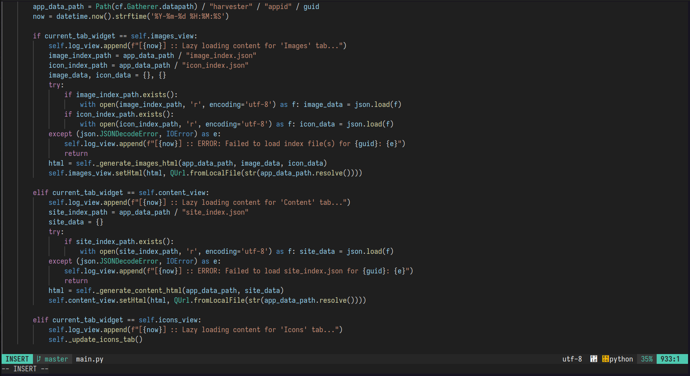

# Admin Scripts

A collection of my personal administrative scripts.

I keep them here on GitHub so I can quickly pull them onto a new system when needed.

You are welcome to use these scripts for any purpose under the terms of the MIT License.  
**Use at your own risk.**  
No warranties of any kind are provided.

These scripts were not designed for public use or distribution. I originally wrote them for myself only.

---
## `scripts/neovim-install.sh`

This script installs and configures Neovim as a lightweight yet powerful console editor, styled after VSCode. It is intended for quickly replacing standard editors like `nano` or `mcedit` on servers.

### What it does

1.  **Checks and installs dependencies:** `neovim`, `git`, `curl`, `build-essential`, `xclip`, `ripgrep`.
2.  **Completely clears old Neovim configurations** for a clean installation.
3.  **Installs the plugin manager** `lazy.nvim`.
4.  **Creates a configuration file** `init.lua` with plugins and settings for a VSCode-like experience.
5.  **Automatically installs all plugins** on the first run.

### Features

-   **VSCode-like interface:** Default theme is `vscode`, familiar hotkeys.
-   **Syntax highlighting:** For multiple languages using `nvim-treesitter`.
-   **Fuzzy search:** `Telescope` for quick file search (`Ctrl+P`), project-wide text search (`Ctrl+G`), and open buffer search (`Ctrl+B`).
-   **Easy commenting:** (`Ctrl`+`Shift`+`/`).
-   **Interactive theme selection:** `:Themes` command to change the color scheme.
-   **System clipboard integration.**

### Main Hotkeys

| Key(s) | Action |
| --- | --- |
| `Ctrl+S` / `F2` | Save file |
| `Esc` `Esc` / `F10` | Exit editor (with save confirmation) |
| `Ctrl+C` (in visual mode) | Copy to system clipboard |
| `Ctrl+Y` | Delete current line |
| `Ctrl+Z` | Undo last action |
| `F7` | Start search in file |
| `F8` / `Shift+F8` | Next/previous search result |
| `Ctrl+P` | Find files in project (Fuzzy Find) |
| `Ctrl+G` | Search text in all project files (Live Grep) |
| `Ctrl+B` | Search in open buffers |
| `Ctrl`+`Shift`+`/` | Comment/uncomment line/block |

---
## `scripts/install-gh.sh`

This script automates the installation of the [GitHub CLI](https://cli.github.com/) (`gh`) on Debian/Ubuntu systems. It is a prerequisite for using scripts that rely on browser-based GitHub authentication, such as `publish-to-github.sh`.

### What it does

1.  Checks if `gh` is already installed.
2.  If not, it adds the official GitHub CLI repository to `apt`.
3.  Installs the `gh` package.
4.  After installation, you need to run `gh auth login` once to authenticate.

---
## `publish-to-github.sh`

This script pushes your committed changes to the `main` branch of the remote repository on GitHub.

It simplifies the publishing process by using the GitHub CLI for authentication, which means you don't need to manually manage SSH keys or tokens.

### What it does

1.  Verifies that the GitHub CLI (`gh`) is installed.
2.  Checks if you are authenticated with GitHub.
3.  If both checks pass, it executes `git push origin main`.
