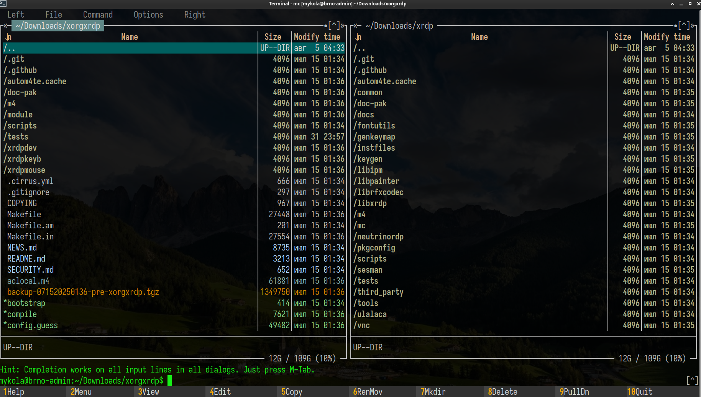
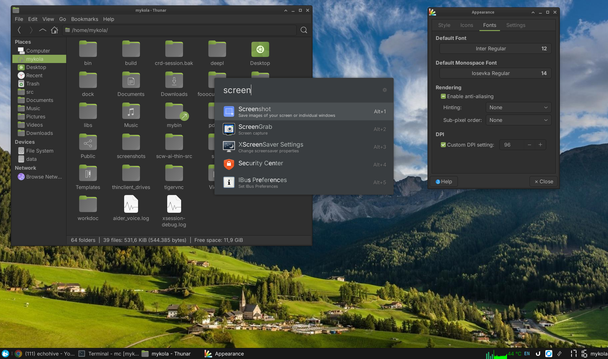

# Admin Scripts

A collection of my personal administrative scripts.

I keep them here on GitHub so I can quickly pull them onto a new system when needed.

You are welcome to use these scripts for any purpose under the terms of the MIT License.  
**Use at your own risk.**  
No warranties of any kind are provided.

These scripts were not designed for public use or distribution. I originally wrote them for myself only.

---
## `scripts/neovim-install.sh`

This script installs and configures Neovim as a lightweight yet powerful console editor, styled after VSCode. It is intended for quickly replacing standard editors like `nano` or `mcedit` on servers.


### What it does

1.  **Checks and installs dependencies:** `neovim`, `git`, `curl`, `build-essential`, `xclip`, `ripgrep`.
2.  **Completely clears old Neovim configurations** for a clean installation.
3.  **Installs the plugin manager** `lazy.nvim`.
4.  **Creates a configuration file** `init.lua` with plugins and settings for a VSCode-like experience.
5.  **Automatically installs all plugins** on the first run.

### Features

-   **VSCode-like interface:** Default theme is `vscode`, familiar hotkeys.
-   **Syntax highlighting:** For multiple languages using `nvim-treesitter`.
-   **Fuzzy search:** `Telescope` for quick file search (`Ctrl+P`), project-wide text search (`Ctrl+G`), and open buffer search (`Ctrl+B`).
-   **Easy commenting:** (`Ctrl`+`Shift`+`/`).
-   **Interactive theme selection:** `:Themes` command to change the color scheme.
-   **System clipboard integration.**

### Main Hotkeys

| Key(s) | Action |
| --- | --- |
| `Ctrl+S` / `F2` | Save file |
| `Esc` `Esc` / `F10` | Exit editor (with save confirmation) |
| `Ctrl+C` (in visual mode) | Copy to system clipboard |
| `Ctrl+Y` | Delete current line |
| `Ctrl+Z` | Undo last action |
| `F7` | Start search in file |
| `F8` / `Shift+F8` | Next/previous search result |
| `Ctrl+P` | Find files in project (Fuzzy Find) |
| `Ctrl+G` | Search text in all project files (Live Grep) |
| `Ctrl+B` | Search in open buffers |
| `Ctrl`+`Shift`+`/` | Comment/uncomment line/block |

---
## `scripts/install-gh.sh`

This script automates the installation of the [GitHub CLI](https://cli.github.com/) (`gh`) on Debian/Ubuntu systems. It is a prerequisite for using scripts that rely on browser-based GitHub authentication, such as `publish-to-github.sh`.

### What it does

1.  Checks if `gh` is already installed.
2.  If not, it adds the official GitHub CLI repository to `apt`.
3.  Installs the `gh` package.
4.  After installation, you need to run `gh auth login` once to authenticate.

---
## `scripts/xfce-setup.sh`

This script automates the setup and customization of an XFCE desktop environment on a Debian/Ubuntu based system. It configures a specialized desktop environment, optimized to perform well on a remote machine and intended primarily for remote administration or development.

### What it does

1.  **Installs XFCE:** Sets up the core XFCE desktop environment without recommended packages for a minimal installation.
2.  **Applies Dark Theme:** Installs and configures the `Yaru-dark` theme for GTK applications, window manager, and icons.
3.  **Configures the Panel:** Removes default panels and creates a single, modern-looking panel at the bottom of the screen. The panel includes:
    -   Whisker Menu for application launching.
    -   A tasklist with flat buttons.
    -   CPU graph and temperature sensors.
    -   System tray, notifications, and a 24-hour LCD-style clock.
4.  **Installs Essential Tools:**
    -   `ulauncher` for quick application and file searching, configured with a dark theme and bound to the `Super` key.
    -   Additional panel plugins like `xfce4-cpugraph-plugin` and `xfce4-whiskermenu-plugin`.
5.  **Customizes Appearance:**
    -   Downloads and sets custom wallpapers for the desktop and the XFCE terminal.
    -   Disables desktop icons for a cleaner look.
    -   Installs `Inter` and `Iosevka` fonts.
    -   Sets `Inter` as the default UI font and `Iosevka` as the monospace font.
    -   Disables UI animations and enables font anti-aliasing for a smoother experience.
    -   Hides window titles for maximized windows to save screen space.

### Usage
To run the script, make it executable and execute it:
```bash
chmod +x scripts/xfce-setup.sh
./scripts/xfce-setup.sh
```
A logout/login may be required for all changes to take effect.




### Use on a remote server

This script is ideal for setting up a graphical environment on a remote server, which can be accessed via tools like VNC (e.g., `tigervnc-standalone-server`) or Chrome Remote Desktop. After running the script, configure your remote desktop service to launch an XFCE session.

